# 前端功能流程图

本文档按前端用户功能组织流程图，重点说明页面跳转、状态来源、API 调用和成功后的页面行为。后端处理细节见 `ww-bill-service/docs/flowcharts/module-flows.md`。

## 文件组织

```text
ww-bill-client/
├── README.md
├── docs/
│   ├── README.md
│   └── flowcharts/
│       └── feature-flows.md
└── src/
```

采用项目级 `docs/flowcharts/` 的原因：

- 流程图是跨页面、跨 Hook、跨 API 的说明，不适合塞进单个页面目录。
- Mermaid 放在 Markdown 中可直接渲染，也便于代码评审时查看差异。
- 后续如果某个功能过大，可从本文档拆成 `docs/flowcharts/<feature>.md`。

## 功能索引

| 功能 | 主要页面 | 主要 API |
| --- | --- | --- |
| 启动与导航 | `src/pages/first-screen`, `src/app/router.tsx`, `src/pages/record/detail` | `/record`, `/user-app-config` |
| 登录注册与找回密码 | `src/pages/auth/login`, `src/pages/auth/sign`, `src/pages/auth/forget-password` | `/tools/email`, `/auth/*` |
| 记账与流水 | `src/pages/record/bookkeeping`, `src/pages/record/detail`, `src/pages/record/editing`, `src/pages/record/record-calendar`, `src/pages/record/search-record` | `/record`, `/category` |
| 账单与导出分享 | `src/pages/bill`, `src/pages/export-data`, `src/pages/share` | `/record/bill`, `/record` |
| 预算 | `src/pages/budget`, `src/pages/create-budget-category` | `/budget/*`, `/category` |
| 资产 | `src/pages/asset/*` | `/asset/*` |
| 图表 | `src/pages/chart/*` | `/chart` |
| 发票助手 | `src/pages/invoice/*` | `/invoice/*` |
| 固定支出 | `src/pages/fixed-expense/*` | `/fixed-expense/*` |
| 社区 | `src/pages/community`, `src/pages/topic-detail`, `src/pages/post-topic` | `/topic/*`, `/follow/*`, `/upload` |
| 消息 | `src/pages/message`, `src/pages/new-follow`, `src/pages/comment-list`, `src/pages/system-notify` | `/follow/*`, `/topic/:id/comment`, `/system_notify` |
| 我的与设置 | `src/pages/mine`, `src/pages/user/user-info`, `src/pages/user/password`, `src/pages/settings`, `src/pages/user/email-change`, `src/pages/category-settings` | `/user/*`, `/check_in`, `/user-app-config`, `/user-email/*`, `/category` |

## 应用启动与路由

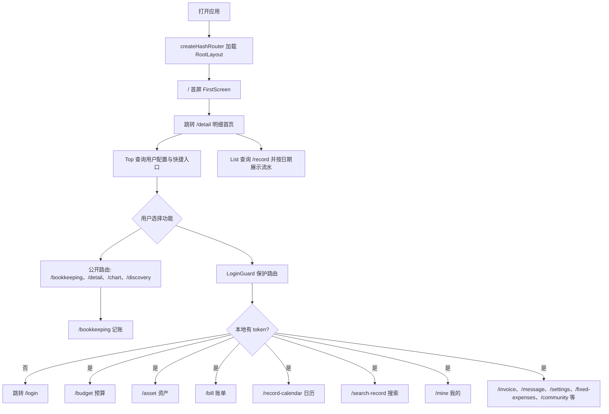

源码入口：`src/app/router.tsx`, `src/pages/first-screen/FirstScreenPage.tsx`, `src/pages/record/detail/*`, `src/widgets/layout/*`。

路由保护说明：`/user-info`、`/password`、`/post-topic` 继续由 `LoginGuard` 保护；预算、发票、社区、消息、设置、资产、固定支出等父级/index 与子路由，以及 `/mine`、`/share`、`/export-data`、`/bill`、`/record-calendar`、`/search-record`、`/topic-detail/:id`、`/category` 均按 token 登录态访问。`/login`、`/sign`、`/forget-password/*`、`/detail`、`/bookkeeping`、`/editing/:id`、`/chart/*`、`/discovery` 与未命中页保持公开；`/cateGory` 是未包 `LoginGuard` 的兼容重定向，最终进入受保护的 `/category`。

## 登录、注册与找回密码

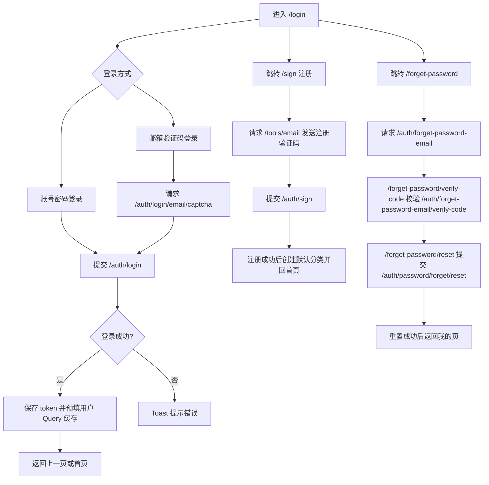

源码入口：`src/pages/auth/login/LoginPage.tsx`, `src/pages/auth/sign/SignPage.tsx`, `src/pages/auth/forget-password/*`, `src/entities/auth`, `src/entities/tools`, `src/features/auth`, `src/features/email-captcha`。

## 记账、明细、编辑与搜索

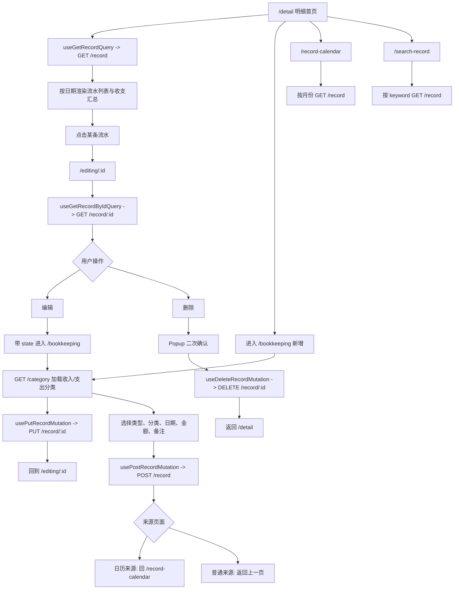

源码入口：`src/pages/record/detail/*`, `src/pages/record/bookkeeping/*`, `src/pages/record/editing/*`, `src/pages/record/record-calendar/*`, `src/pages/record/search-record/*`, `src/entities/record`。

## 账单、导出与分享

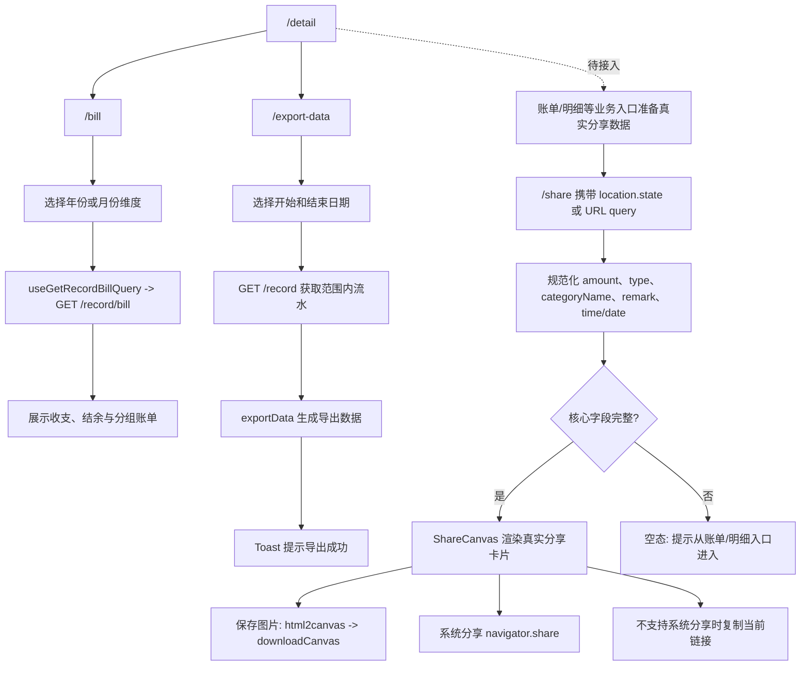

源码入口：`src/pages/bill/*`, `src/pages/export-data/ExportDataPage.tsx`, `src/pages/share/*`, `src/entities/record`, `src/shared/lib/export-data.ts`。

当前缺口：截至 2026-07-16，源码中未发现账单、图表或明细主动跳转 `/share` 的调用方；流程图中的分享入口仍是计划链路，不代表端到端已完成。

## 预算

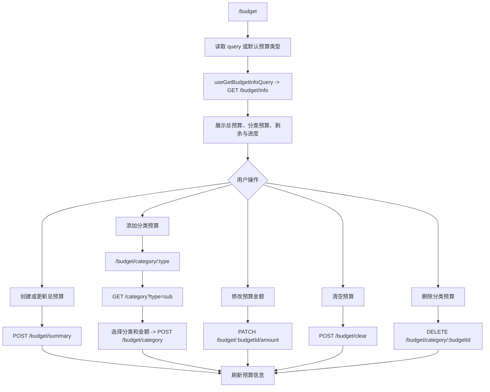

源码入口：`src/pages/budget/*`, `src/pages/create-budget-category/CreateBudgetCategoryPage.tsx`, `src/entities/budget`。

## 资产

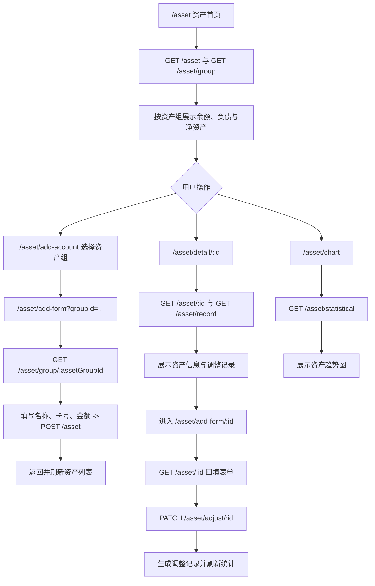

源码入口：`src/pages/asset/*`, `src/entities/asset`。

## 图表

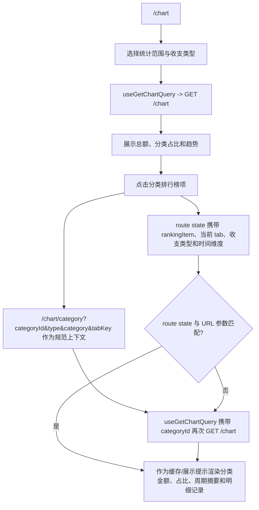

源码入口：`src/pages/chart/*`, `src/entities/chart`。

## 发票助手

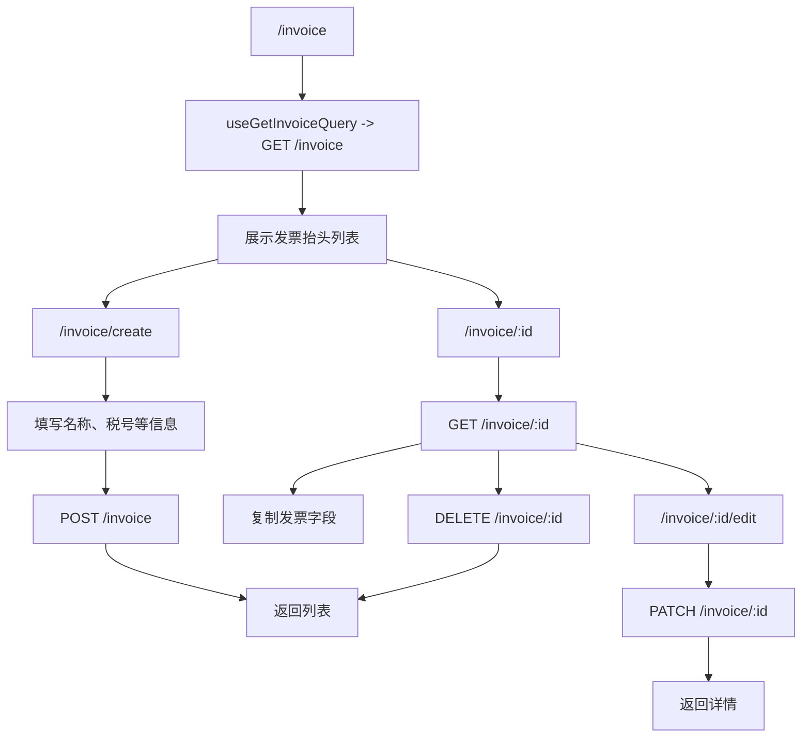

源码入口：`src/pages/invoice/*`, `src/entities/invoice`。

## 固定支出

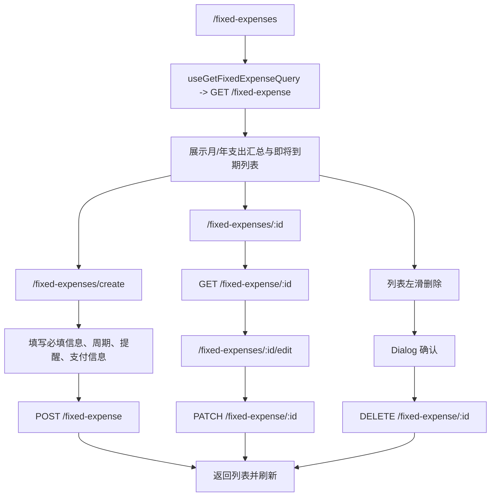

源码入口：`src/pages/fixed-expense/*`, `src/entities/fixed-expense`。

## 社区、关注与评论

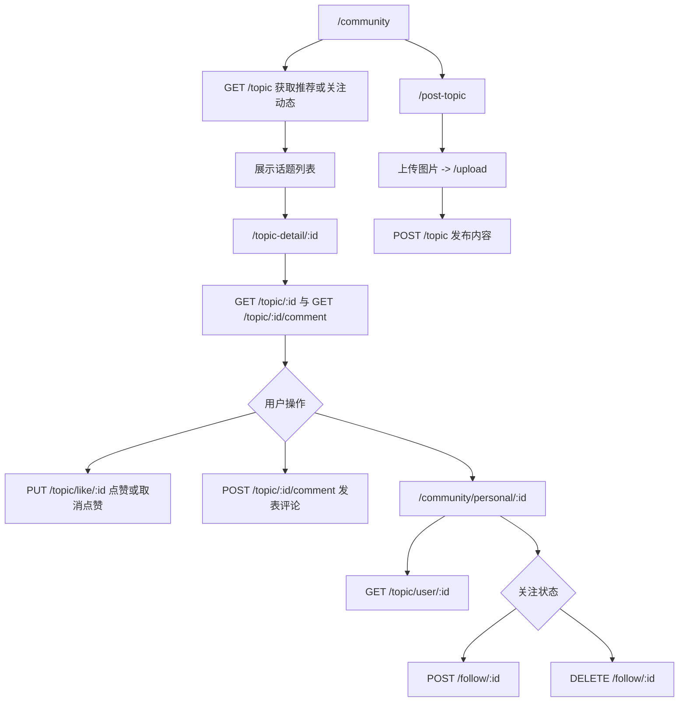

源码入口：`src/pages/community/*`, `src/pages/topic-detail/*`, `src/pages/post-topic/PostTopicPage.tsx`, `src/entities/topic`, `src/entities/follow`。

## 消息

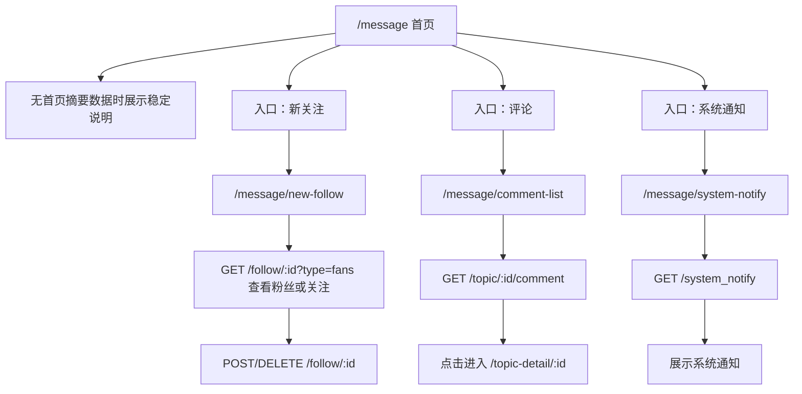

源码入口：`src/pages/message/MessagePage.tsx`, `src/pages/new-follow/NewFollowPage.tsx`, `src/pages/comment-list/CommentListPage.tsx`, `src/pages/system-notify/SystemNotifyPage.tsx`。

## 我的、用户信息与设置

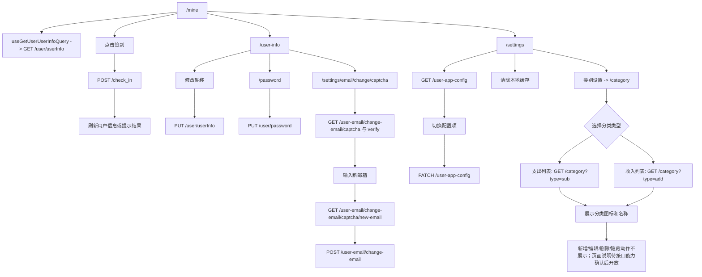

源码入口：`src/pages/mine/*`, `src/pages/user/user-info/UserInfoPage.tsx`, `src/pages/user/password/PasswordPage.tsx`, `src/pages/settings/SettingsPage.tsx`, `src/pages/user/email-change/*`, `src/pages/category-settings/CategorySettingsPage.tsx`, `src/entities/user`, `src/entities/user-app-config`, `src/entities/user-email`, `src/entities/category`。
