# 前端功能流程图

本文档按前端用户功能组织流程图，重点说明页面跳转、状态来源、API 调用和成功后的页面行为。后端处理细节见 `ww-bill-service/docs/flowcharts/module-flows.md`。

## 文件组织

```text
ww-bill-client/
├── README.md
├── docs/
│   ├── README.md
│   └── flowcharts/
│       └── feature-flows.md
└── src/
```

采用项目级 `docs/flowcharts/` 的原因：

- 流程图是跨页面、跨 Hook、跨 API 的说明，不适合塞进单个页面目录。
- Mermaid 放在 Markdown 中可直接渲染，也便于代码评审时查看差异。
- 后续如果某个功能过大，可从本文档拆成 `docs/flowcharts/<feature>.md`。

## 功能索引

| 功能 | 主要页面 | 主要 API |
| --- | --- | --- |
| 启动与导航 | `src/pages/FirstScreen`, `src/router/index.tsx`, `src/pages/detail` | `/record`, `/user-app-config` |
| 登录注册与找回密码 | `src/pages/Login`, `src/pages/Sign`, `src/pages/ForgetPassword` | `/tools/captcha`, `/tools/email`, `/auth/*` |
| 记账与流水 | `src/pages/bookkeeping`, `src/pages/detail`, `src/pages/Detail_editing`, `src/pages/RecordCalendar`, `src/pages/SearchRecord` | `/record`, `/category` |
| 账单与导出分享 | `src/pages/Bill`, `src/pages/export-data`, `src/pages/Share` | `/record/bill`, `/record` |
| 预算 | `src/pages/Budget`, `src/pages/CreateBudgetCategory` | `/budget/*`, `/category` |
| 资产 | `src/pages/Asset/*` | `/asset/*` |
| 图表 | `src/pages/Chart/*` | `/chart` |
| 发票助手 | `src/pages/Invoice/*` | `/invoice/*` |
| 固定支出 | `src/pages/FixedExpenses/*` | `/fixed-expense/*` |
| 社区 | `src/pages/community`, `src/pages/TopicDetail`, `src/pages/PostTopic` | `/topic/*`, `/follow/*`, `/upload` |
| 消息 | `src/pages/Message`, `src/pages/new-follow`, `src/pages/comment-list`, `src/pages/system-notify` | `/follow/*`, `/topic/:id/comment`, `/system_notify` |
| 我的与设置 | `src/pages/mine`, `src/pages/UserInfo`, `src/pages/Password`, `src/pages/settings`, `src/pages/EmailChange` | `/user/*`, `/check_in`, `/user-app-config`, `/user-email/*` |

## 应用启动与路由

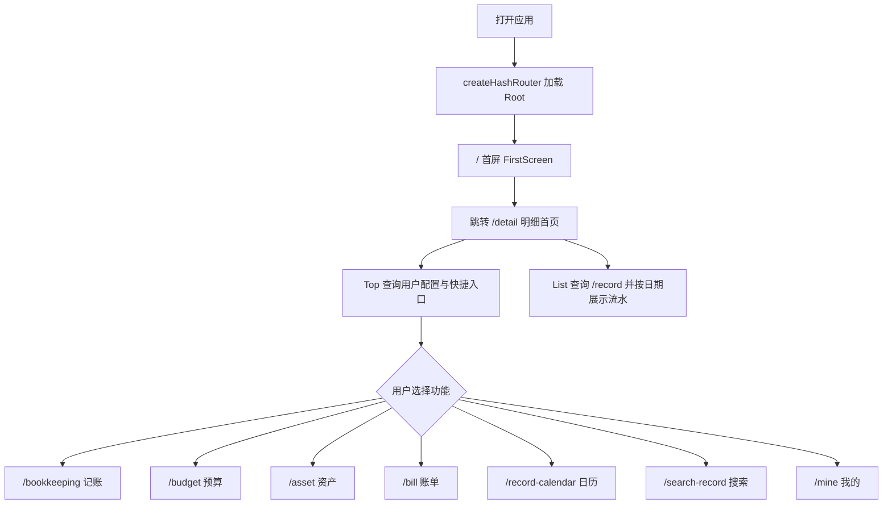

源码入口：`src/router/index.tsx`, `src/pages/FirstScreen/index.tsx`, `src/pages/detail/*`。

## 登录、注册与找回密码

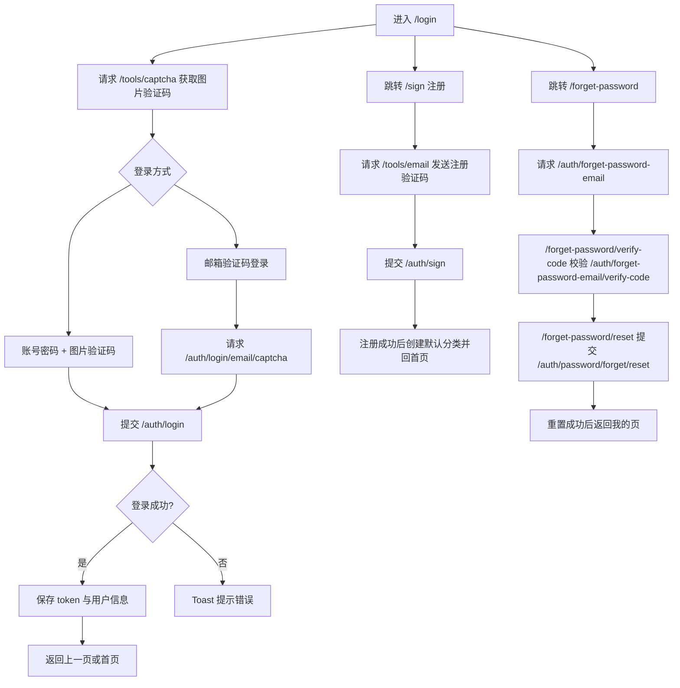

源码入口：`src/pages/Login/index.tsx`, `src/pages/Sign/index.tsx`, `src/pages/ForgetPassword/*`, `src/api/auth.ts`, `src/api/tools.ts`。

## 记账、明细、编辑与搜索

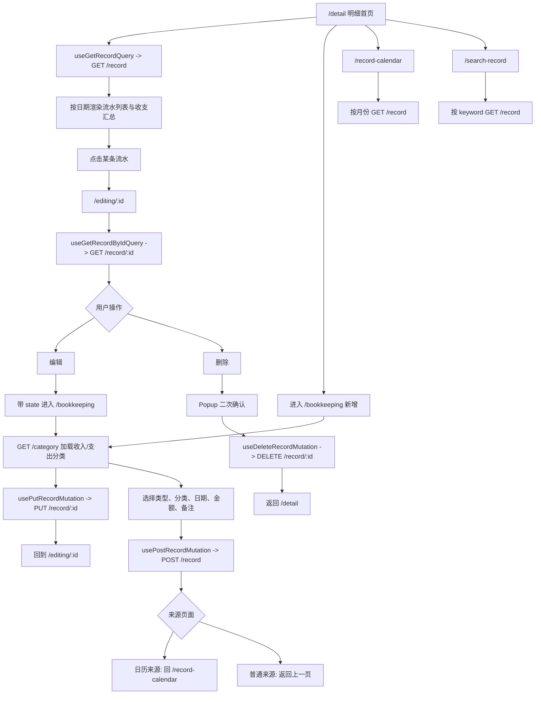

源码入口：`src/pages/detail/*`, `src/pages/bookkeeping/*`, `src/pages/Detail_editing/*`, `src/pages/RecordCalendar/index.tsx`, `src/pages/SearchRecord/*`, `src/api/record.ts`。

## 账单、导出与分享

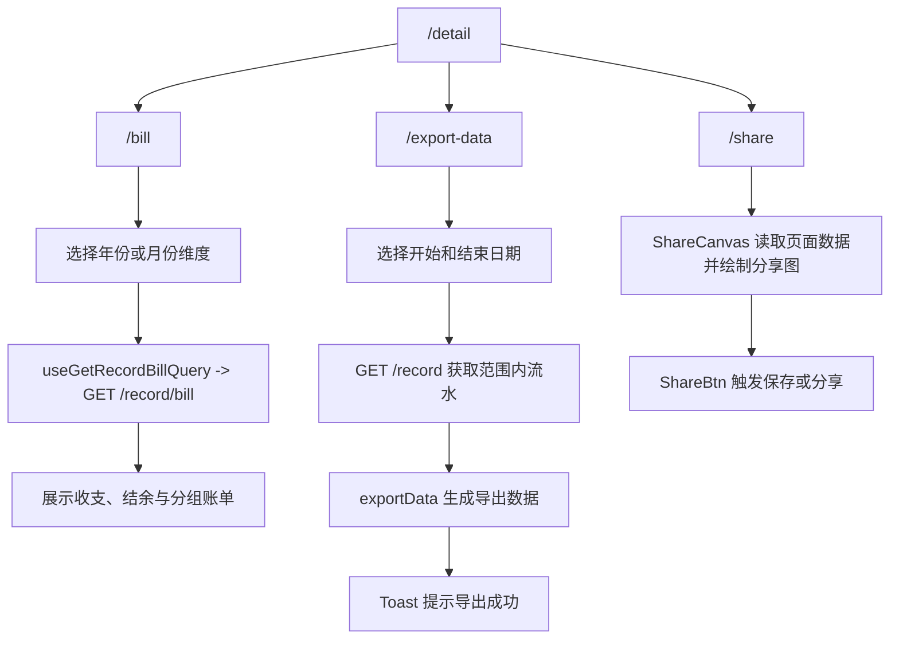

源码入口：`src/pages/Bill/*`, `src/pages/export-data/index.tsx`, `src/pages/Share/*`, `src/api/record.ts`, `src/utils/exportData.ts`。

## 预算

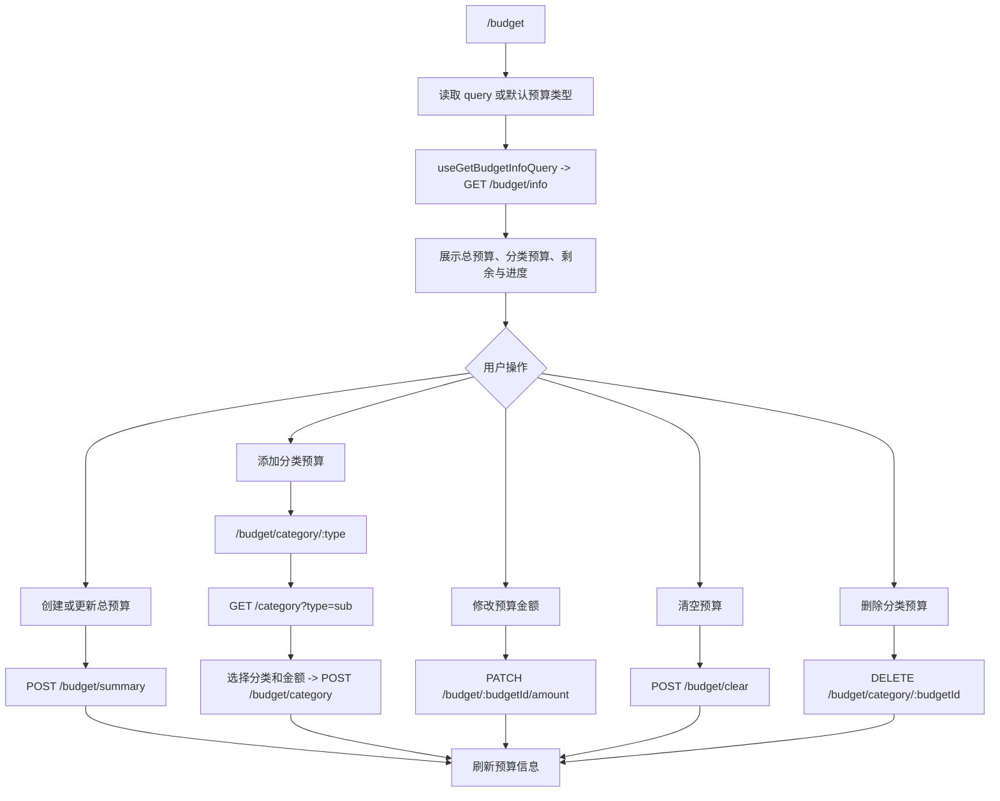

源码入口：`src/pages/Budget/*`, `src/pages/CreateBudgetCategory/index.tsx`, `src/api/budget.ts`。

## 资产

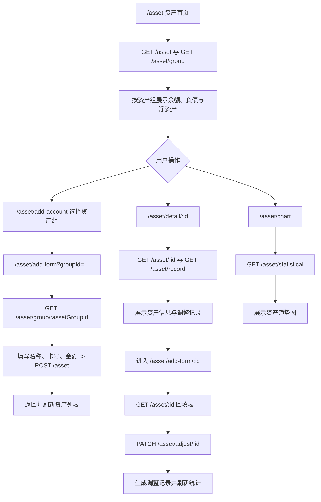

源码入口：`src/pages/Asset/*`, `src/api/asset.ts`, `src/hooks/useAssetSummaryInfo.ts`, `src/hooks/useAssetStatisticalRecord.ts`。

## 图表

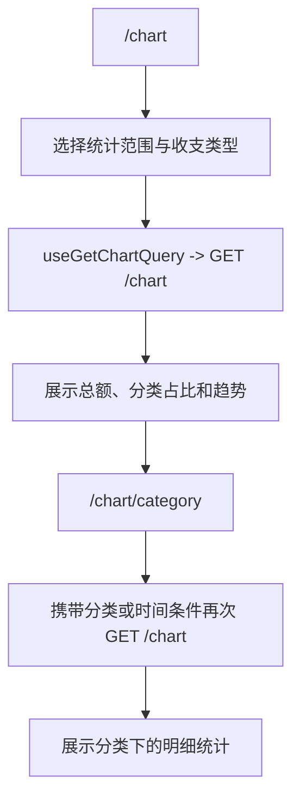

源码入口：`src/pages/Chart/*`, `src/hooks/useChart.ts`, `src/api/chart.ts`。

## 发票助手

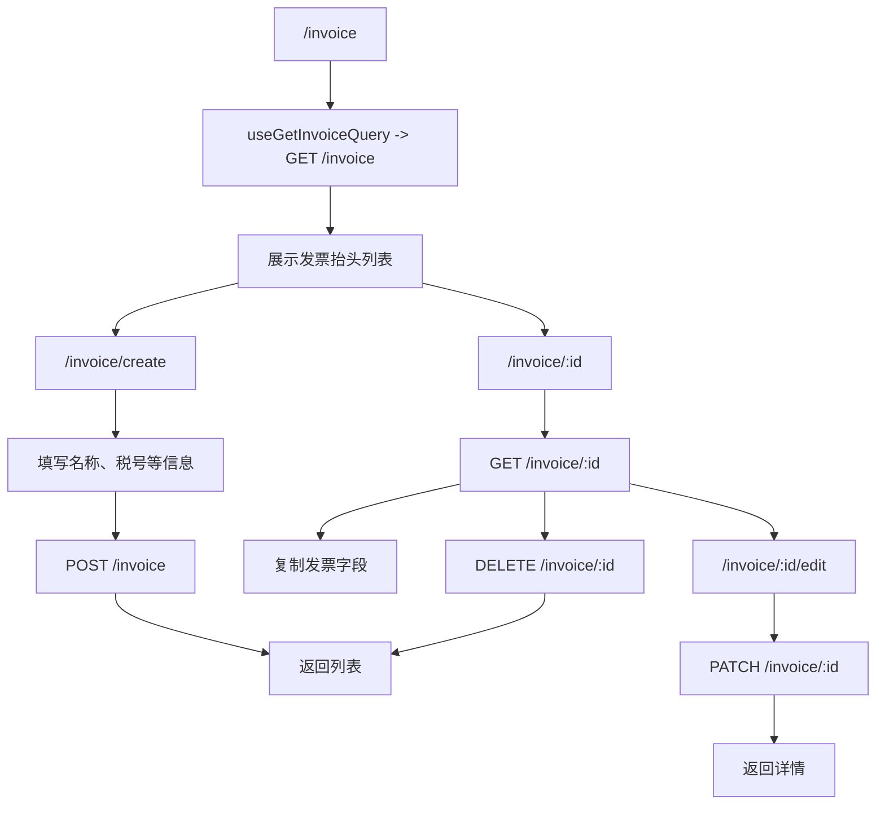

源码入口：`src/pages/Invoice/*`, `src/api/invoice.ts`。

## 固定支出

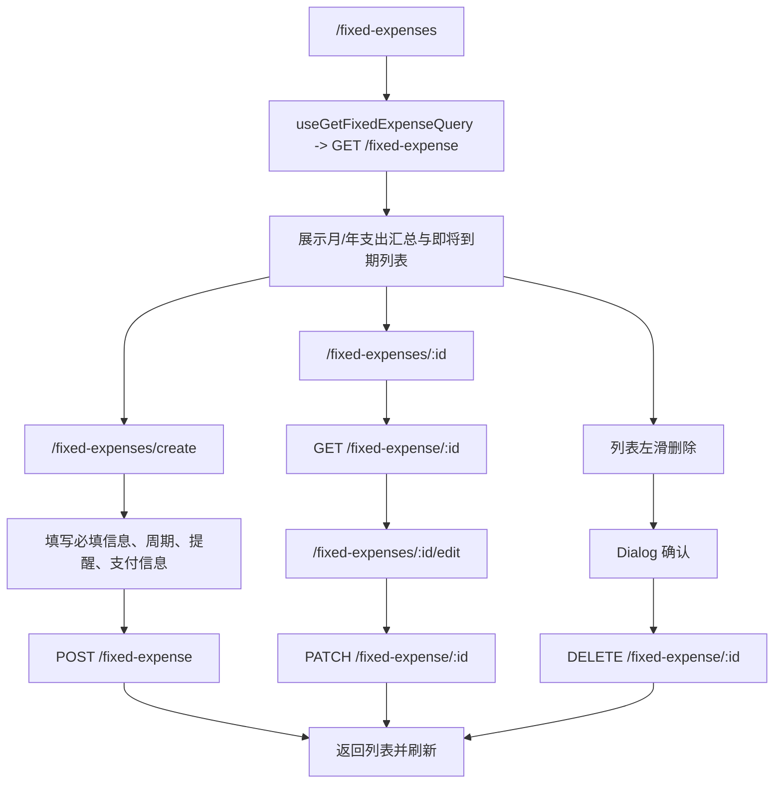

源码入口：`src/pages/FixedExpenses/*`, `src/api/fixed-expense.ts`。

## 社区、关注与评论

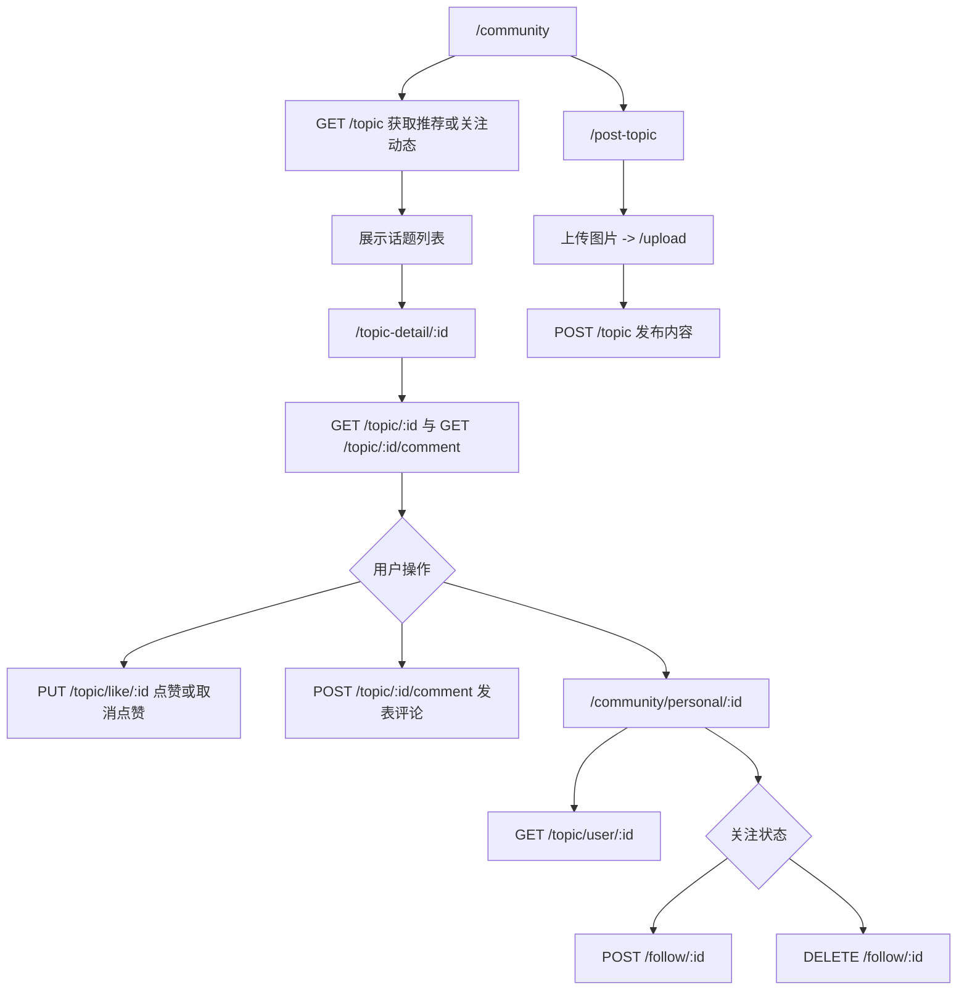

源码入口：`src/pages/community/*`, `src/pages/TopicDetail/*`, `src/pages/PostTopic/index.tsx`, `src/api/topic.ts`, `src/api/follow.ts`, `src/api/index.ts`。

## 消息

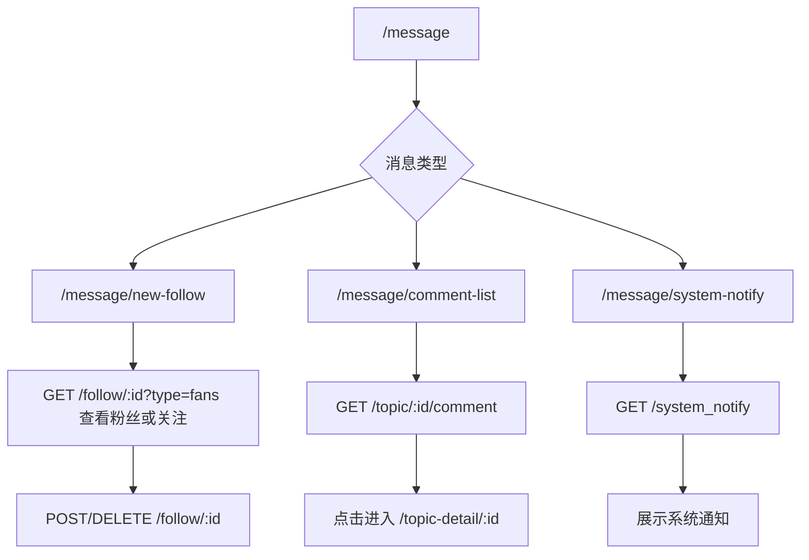

源码入口：`src/pages/Message/index.tsx`, `src/pages/new-follow/index.tsx`, `src/pages/comment-list/index.tsx`, `src/pages/system-notify/index.tsx`。

## 我的、用户信息与设置

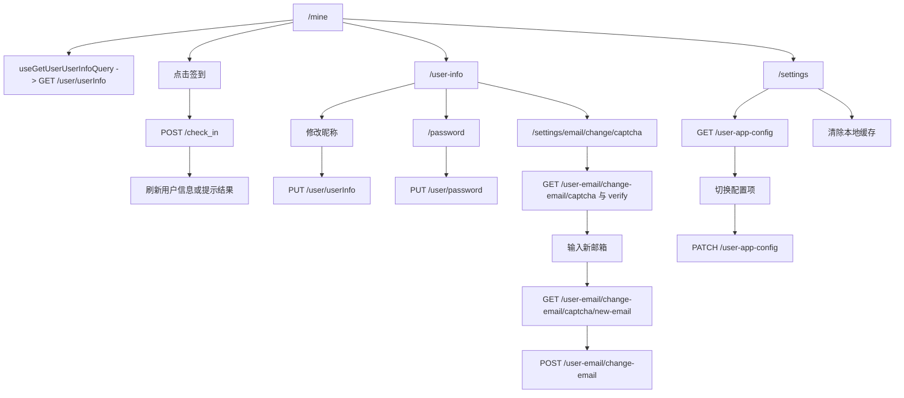

源码入口：`src/pages/mine/*`, `src/pages/UserInfo/index.tsx`, `src/pages/Password/index.tsx`, `src/pages/settings/index.tsx`, `src/pages/EmailChange/*`, `src/api/user.ts`, `src/api/user-app-config.ts`, `src/api/user-email.ts`。
