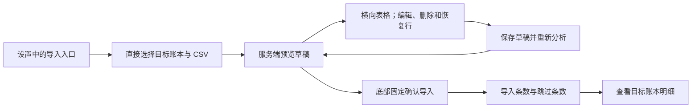

# 鲨鱼记账导入页面

账本设置入口会把当前账本 ID 带到导入页，其他入口要求用户选择有记账权限的目标账本。鲨鱼记账的上传控件直接显示在导入页，其他软件仍显示适配说明。选择非个人账本时，页面提示不支持关联个人资产；源账户仅在预览中供核对，服务端自动设为不关联，不产生逐行资产问题，也不改变资产余额。

预览页按 100 行分页显示全部记录，横向滚动查看日期、收支、类别、金额、备注、标签、源账户、资产处理和问题；非个人账本隐藏资产处理列及逐行编辑控件。行号、编辑与删除操作固定在左侧。可切换“全部”和“待处理”快速定位问题行。存在问题或没有待导入行时禁止确认，底部操作区始终留在视口内。

行编辑保存整个草稿并携带 `revision`。服务端重新分析后的行、汇总及错误成为界面唯一状态；版本冲突或提交失败时重新加载预览。确认成功后刷新流水、图表、分类、标签、资产及账本导航缓存。

原文件没有备注时保留空备注；流水列表和详情展示分类名作为显示文字，不回写导入记录的备注。

从导入页上传后进入预览，预览页的“返回”沿原有历史回到导入页，再返回可回到进入导入页之前的页面。直接打开预览链接时，“返回”会用导入页替换当前历史项，避免两个页面互相入栈形成循环。
