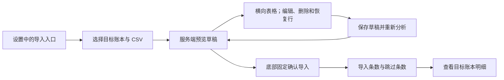

# 鲨鱼记账导入页面

账本设置入口会把当前账本 ID 带到导入页，其他入口要求用户选择有记账权限的目标账本。预览页按 100 行分页显示全部记录，横向滚动查看日期、收支、类别、金额、备注、标签、源账户、资产处理和问题。存在问题或没有待导入行时禁止确认。

行编辑保存整个草稿并携带 `revision`。服务端重新分析后的行、汇总及错误成为界面唯一状态；版本冲突或提交失败时重新加载预览。确认成功后刷新流水、图表、分类、标签、资产及账本导航缓存。
