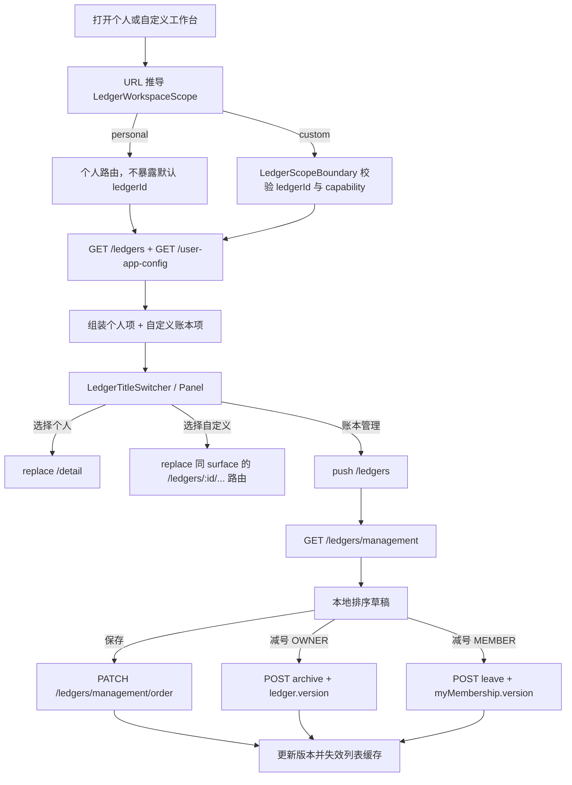

# 我的账本管理与工作台切换设计

**状态：** 已确认，可进入实施计划

**日期：** 2026-07-22
**涉及仓库：** `ww-bill-client`、`ww-bill-service`、`ww-bill-admin`

## 2026-07-23 首页切换交互纠偏（覆盖后文冲突描述）

- 不替换现有个人明细首页的黄色主题头部，也不改变年份/月、收支统计、金额显隐、搜索、日历、功能卡片和底部导航的位置。
- 默认账本首页继续显示产品名 `config.appName`；自定义账本首页显示当前账本名称。
- 只把现有居中标题增强为可点击标题：快捷切换开启时显示下拉箭头并打开账本切换面板，关闭时保持原静态标题。
- 切换面板中的 `SYSTEM_DEFAULT` 用户可见名称固定为“默认账本”。服务端真实名称和底层账本 ID 仍不渲染、不写入个人路由。
- “默认账本”只出现在切换面板中，不出现在 `/ledgers` 账本管理卡片列表，也没有归档、退出、排序或设置入口。
- 首页不显示仿小程序胶囊；搜索和日历保留为原来的直接按钮，不迁入 `ActionSheet`。
- 后文中“个人账本”用户文案、首页独立白色 `NavBar`、胶囊返回按钮以及把搜索/日历迁入更多菜单的描述，均以本节为准。

## 1. 目标

本次调整把当前已经具备数据隔离能力的多账本后端，整理成用户可以理解、可以稳定操作的“个人记账 + 自定义账本”产品体验：

- “我的 → 我的账本”只展示用户创建或加入的自定义账本。
- 底层 `SYSTEM_DEFAULT` 账本继续承载个人记账数据，但用户界面不出现“系统默认账本”、底层 UUID、归档或退出入口。
- 自定义账本工作台顶部显示当前账本名称，点击名称可以切换账本；选择“默认账本”回到默认记账首页。
- 所有者在管理模式中执行“归档账本”，普通成员执行“退出账本”；两者都使用现有服务端事务和乐观锁。
- 用户可以拖动自定义账本调整自己的展示顺序，不影响其他成员的顺序。
- 常规控件优先使用 Ant Design Mobile 5，只有账本卡面、标题切换触发器和拖拽协调层按需自研。
- 管理后台继续看见并治理包括 `SYSTEM_DEFAULT` 在内的全量账本，但不展示或编辑用户私有排序、快捷入口设置。

## 2. 范围与非目标

### 2.1 本次范围

- “我的账本”管理页、排序态、归档/退出交互。
- 加入账本表单的 Ant Design Mobile 化与现有申请流程衔接。
- 全局“分账本快捷入口”设置。
- 个人工作台和自定义账本工作台之间的切换导航。
- 自定义账本明细、记账、账单、预算、图表工作台导航补齐。
- 服务端管理列表、切换列表字段、批量排序、快捷入口偏好和安全迁移。
- 管理后台回归验证。

### 2.2 非目标

- 不修改家庭账单/家庭账本领域模型、邀请模型或页面。
- 不新增“当前账本”数据库字段、Zustand store、localStorage 或 sessionStorage 持久化。
- 不删除 `SYSTEM_DEFAULT` 账本，也不把个人数据搬离它。
- 不新增硬删除账本能力；所有者只能归档。
- 不在本次把资产账户、发票、固定支出或家庭数据跟随账本切换。
- 不改造管理后台的账本治理信息架构；现有全量治理能力保留。

## 3. 产品术语与可见性规则

| 服务端概念 | 用户界面文案 | 是否出现在“账本管理” | 是否可归档/退出 |
|---|---|---:|---:|
| `SYSTEM_DEFAULT` | `默认账本`（仅切换面板） | 否 | 否 |
| 用户拥有的 `CUSTOM` | 实际账本名 | 是 | 所有者可归档 |
| 用户加入的 `CUSTOM` | 实际账本名 | 是 | 普通成员可退出 |

约束：

- 客户端绝不直接渲染服务端返回的默认账本名称或“系统默认账本”文案；切换面板使用固定文案“默认账本”。
- 切换器中的“默认账本”是一个导航视图模型；选择它只导航到默认个人路由，不把底层默认账本 ID 写入 URL。
- 管理页只能消费 `GET /ledgers/management`；即使客户端过滤失效，服务端也不返回 `SYSTEM_DEFAULT`。
- 客户端仍做 `kind === CUSTOM` 防御过滤，避免异常响应被渲染成可破坏卡片。

## 4. 账本上下文与路由

### 4.1 唯一权威

当前账本上下文由 URL 唯一决定：

```ts
type LedgerWorkspaceScope =
  | { type: 'personal' }
  | { type: 'custom'; ledgerId: string };

type LedgerSurface =
  | 'records'
  | 'record-create'
  | 'bill'
  | 'budget'
  | 'charts';
```

- 个人路由没有 `ledgerId`，服务端沿用 `ensureSystemDefaultLedger(userId)`。
- 自定义账本路由必须携带 `:ledgerId`，所有查询继续由 `LedgerScopeBoundary` 校验权限。
- 浏览器刷新、前进后退和深链都从 URL 恢复，不依赖内存中的“最近账本”。

### 4.2 路由映射

| Surface | 个人账本 | 自定义账本 |
|---|---|---|
| 明细 | `/detail` | `/ledgers/:ledgerId/records` |
| 记账 | `/bookkeeping` | `/ledgers/:ledgerId/records/new` |
| 账单 | `/bill` | `/ledgers/:ledgerId/bill` |
| 预算 | `/budget` | `/ledgers/:ledgerId/budget` |
| 图表 | `/chart` | `/ledgers/:ledgerId/charts` |

补充路由：

- `/ledgers`：自定义账本管理。
- `/ledgers/preferences`：用户级账本快捷入口设置，必须注册在动态 `:ledgerId` 之前。
- `/ledgers/:ledgerId`：保留为当前自定义账本详情/管理中心，不再作为点击卡片后的默认落点。

切换规则：

- 在同一 surface 中切换账本时使用 `navigate(target, { replace: true })`，避免浏览器返回键逐本回放。
- 从“我的账本”点击卡片进入自定义明细时使用普通 push，返回键可以回管理页。
- 圆圈按钮始终 `replace('/detail')`，不保留任何自定义账本 ID。
- 切换目标必须读取目标账本 `capabilities`：记账需要 `RECORD_CREATE`，明细/账单需要 `RECORD_READ`，预算需要 `BUDGET_READ`，图表需要 `CHART_READ`。目标 surface 不可用时先降级到目标账本明细；若连 `RECORD_READ` 都没有，再降级到 `/ledgers/:ledgerId` 管理中心，不打开 403/404。

## 5. 页面信息架构

### 5.0 我的账本完整页面清单

下表是本模块的完整路由边界。`重做` 表示本轮按参考图重构，`接入` 表示保留主体功能但接入新工作台上下文，`保持` 表示只做回归验证。

| 路由 | 页面职责 | 本轮处理 | 主要数据源 |
|---|---|---|---|
| `/ledgers` | 自定义账本管理、排序、归档/退出 | 重做 | management list / reorder / archive / leave |
| `/ledgers/preferences` | 分账本快捷入口设置 | 新增 | user app config |
| `/ledgers/templates` | 选择生意/报销/公司/团队等模板 | 保持；入口衔接 | ledger templates |
| `/ledgers/create` | 填写模板账本名称和月起始日 | 接入；成功转 records | create ledger |
| `/ledgers/join` | 输入邀请码和申请附言 | 重做表单 | submit join request |
| `/ledgers/applications` | 查看我的加入申请 | 保持 | my join requests |
| `/ledger-invites/:code` | 邀请预览 | 保持 | invitation preview |
| `/ledgers/:ledgerId/records` | 自定义账本明细首页 | 接入完整切换头和底栏 | scoped records / ledger detail |
| `/ledgers/:ledgerId/records/new` | 自定义账本记账 | 接入返回路径与权限 | categories / create record |
| `/ledgers/:ledgerId/records/search` | 自定义账本搜索 | 保持 ledger scope | scoped records |
| `/ledgers/:ledgerId/records/:recordId` | 记录详情 | 保持 ledger scope | scoped record detail |
| `/ledgers/:ledgerId/records/:recordId/edit` | 编辑记录 | 保持 ledger scope | scoped record mutation |
| `/ledgers/:ledgerId/bill` | 自定义账本月/年账单 | 新增页面，复用账单呈现 | scoped bill |
| `/ledgers/:ledgerId/budget` | 自定义账本预算 | 接入胶囊与底栏 | scoped budget |
| `/ledgers/:ledgerId/charts` | 自定义账本图表 | 接入胶囊与底栏 | scoped charts / preferences |
| `/ledgers/:ledgerId/calendar` | 自定义账本日历 | 保持 | scoped records |
| `/ledgers/:ledgerId` | 自定义账本详情/管理中心 | 保持；More 菜单入口 | ledger detail |
| `/ledgers/:ledgerId/settings` | 名称、月份、成员、数据、安全设置 | 保持；复用退出能力 | ledger / preferences / members |
| `/ledgers/:ledgerId/settings/categories` | 分类管理 | 保持 | scoped categories |
| `/ledgers/:ledgerId/settings/tags` | 标签管理 | 保持 | scoped tags |
| `/ledgers/:ledgerId/members` | 成员列表/邀请入口 | 保持 | members |
| `/ledgers/:ledgerId/members/:memberId` | 成员角色与昵称 | 保持 | members / update member |
| `/ledgers/:ledgerId/invites` | 生成、复制、撤销邀请码 | 保持 | invitation |
| `/ledgers/:ledgerId/join-requests` | 加入申请列表 | 保持 | join requests |
| `/ledgers/:ledgerId/join-requests/:requestId` | 审批申请并分配角色 | 保持 | decide join request |
| `/ledgers/:ledgerId/export` | 导出数据 | 保持 | export task |
| `/ledgers/:ledgerId/recovery` | 恢复删除记录 | 保持 | recovery |
| `/ledgers/:ledgerId/transfer` | 跨账本迁移记录 | 保持 | transfer operation |

个人页 `/detail`、`/bookkeeping`、`/bill`、`/budget`、`/chart` 不变成显式账本路由，只接入工作台头部/导航；这样用户仍然无感使用底层个人默认账本。

### 5.1 我的账本管理页 `/ledgers`

#### 普通态

```text
NavBar
├── 左：返回
├── 中：账本管理
└── 右：设置图标 → /ledgers/preferences

ScrollableContent
└── LedgerCoverGrid（仅 CUSTOM，3 列）
    └── LedgerCoverCard × N

FixedFooter
└── + 创建账本 → /ledgers/templates
```

行为：

- 数据源为 `GET /ledgers/management`。
- 卡片按用户私有 `sortOrder` 排列。
- 卡片点击进入 `/ledgers/:ledgerId/records`。
- `activeMemberCount > 1` 时显示“共 N 人”。
- 触屏/鼠标长按卡片进入排序态；键盘聚焦卡片后按空格进入排序态，`Enter` 仍打开账本。进入后所有卡片保持位置不跳动。
- 空态说明“还没有自定义账本”，主操作仍是“创建账本”，辅助入口是“加入账本”。
- `SUSPENDED` 账本仍显示状态标记和可读入口，不能伪装成正常可写账本。

#### 排序/管理态

```text
NavBar（位置不变）
LedgerCoverGrid
└── SortableLedgerCard
    └── RemoveBadge（左上角减号）
FixedSaveOrderButton
```

- 拖拽只修改本地草稿；点击“保存排序”才调用批量接口。
- 排序态支持键盘传感器与读屏播报；减号必须是带账本名和动作名的可聚焦按钮。
- 离开且草稿已变更时用 `Dialog.confirm` 询问是否放弃。
- 所有者点击减号：确认后调用归档接口。
- 非所有者点击减号：确认后调用退出接口。
- 任何异常 `SYSTEM_DEFAULT` 项都不渲染。
- 409 表示列表、成员或账本版本已变化：丢弃草稿，重新请求管理列表并提示用户重试。
- 归档/退出成功后从草稿与 React Query 缓存中移除；如果用户正处在该账本工作台，跳回 `/detail`。

### 5.2 账本快捷设置 `/ledgers/preferences`

```text
NavBar（主题色）
List
└── List.Item
    ├── 标题：分账本快捷入口
    ├── 说明：开启后，可在账本首页快速切换账本
    └── Switch
```

- 这是用户级配置，不属于某一本账本。
- 默认关闭，避免发布后无提示改变现有首页。
- `Switch.onChange` 等待 Promise；失败时回滚并 Toast。
- 409 时重新获取配置，提示“设置已在其他页面更新”。

### 5.3 加入账本 `/ledgers/join`

页面继续沿用现有“提交申请，而非立即加入”语义：

```text
NavBar
Form
├── 邀请码 Input（6 位，自动大写）
├── 申请附言 TextArea（1–30 字）
└── 提交 Button

成功态
├── CheckCircleFill
├── 加入申请已发送
├── 24 小时有效说明
└── 完成 Button
```

- 空邀请码、非法 6 位邀请码、空附言和超过 30 字都不能提交。邀请码必须与服务端字符集一致：`[A-HJ-NP-Z2-9]{6}`，明确排除易混淆的 `0/1/I/O`。
- `Form`、`Input`、`TextArea`、`Button`、`Toast` 全部使用 Ant Design Mobile。
- 幂等键继续复用现有实现。

### 5.4 账本工作台头部

#### 明细首页

账本切换组件不得接管业务页面导航。个人明细首页只把原有居中产品标题替换为 `LedgerTitleSwitcher`，其余年份、月份、收支、搜索、日历、功能卡和底部导航保持历史结构：

```text
搜索                  当前账本名 ▼                  日历
```

- 个人视图显示产品名。
- 自定义视图显示实际账本名称。
- 快捷入口开启时，点击名称打开账本切换面板；关闭时名称为静态文本且不显示箭头。
- 个人明细原有搜索和日历保持直接按钮，并保持原路由与日期参数。
- 自定义记录页可在自己的业务头部复用 `LedgerTitleSwitcher`，并保留工作台 TabBar。

#### 账单/预算/图表

这些页面的中心标题承担“月/年、收入/支出、周期”等业务筛选，不渲染账本切换组件：

- 个人图表保留支出/收入和周/月/年筛选，并通过个人底部 TabBar 导航。
- 个人预算保留共享 `NavBar` 返回按钮和月/年预算筛选。
- 个人账单保留年份、月/年账单筛选和底部返回按钮。
- 自定义图表使用业务标题和工作台 TabBar。
- 自定义预算、账单使用各自页面外壳和明确返回账本详情的入口。

- 圆圈保持回个人首页能力。
- 快捷入口开启时，`⋯` 的 ActionSheet 提供“切换账本”，打开同一个 `LedgerSwitcherPanel`；关闭时不出现该动作。
- 这样不会把“切换账本”和“切换统计维度”混成一个下拉。

### 5.5 账本切换面板

面板结构尽量贴近参考图，但采用系统主题：

```text
默认账本
└── N 笔记录

自定义账本 × N
├── 单人账本：无副标题
└── 多人账本：N 人

[创建账本] [账本管理]
```

- `SYSTEM_DEFAULT` 响应只转换成“默认账本”视图模型，不显示服务端名称或 ID。
- 当前项显示 `CheckOutline`。
- 默认账本永远排首位；自定义账本按 `sortOrder`。
- 切换面板加载失败时显示局部错误和重试，不破坏当前页面。
- 没有自定义账本时仍显示个人项与两个底部操作。

### 5.6 底部导航

- 个人模式继续使用 5 项：明细、图表、记账、发现、我的。
- 自定义账本模式按参考图使用 3 项：明细、记账、图表。
- 自定义记账入口需要 `RECORD_CREATE`；没有权限时禁用并给出 Toast，不跳转。
- 底栏改用官方 `TabBar`；保留现有中间记账按钮的产品层级，但不继续扩展旧 `@/shared/ui` 基础封装。

## 6. 组件边界

### 6.1 官方 Ant Design Mobile 组件

- `NavBar`
- `Grid`
- `SafeArea`
- `Form`
- `Input`
- `TextArea`
- `Button`
- `List`
- `Switch`
- `Popup` 或 `Dropdown`
- `ActionSheet`
- `Dialog`
- `Toast`
- `ErrorBlock`
- `SpinLoading`
- `Tag`
- `TabBar`

### 6.2 必须自研的业务组件

```text
features/ledger-switcher
├── model/ledger-navigation.ts
├── model/ledger-switcher-view-model.ts
└── ui
    ├── LedgerTitleSwitcher.tsx
    ├── LedgerSwitcherPanel.tsx

entities/ledger/ui
└── LedgerCoverCard.tsx

pages/ledger-center/ui
├── LedgerManagementGrid.tsx
├── SortableLedgerGrid.tsx
├── RemoveLedgerBadge.tsx
└── LedgerManagementFooter.tsx
```

边界：

- `LedgerCoverCard` 只处理卡面、多人标签、状态和点击/长按反馈。
- `SortableLedgerGrid` 只处理拖拽坐标、键盘传感器和草稿排序，不请求网络。
- 页面负责查询、Mutation、Dialog、导航和缓存失效。
- `MiniProgramCapsule` 只是外观和按钮语义，不持有账本列表数据。
- 不建立新的通用 UI 框架。

## 7. 视觉规格

- 基准 viewport：`390 × 844`。
- 页面根使用 `.page-new`、`SafeArea` 和现有系统字体。
- 顶部总高度约 `97px`（安全区 + 49px 导航）。
- 管理页内容左右 `20px`；三列网格约 `107 × 146px`，列间 `14px`，行间 `16px`。
- 卡片圆角约 `8px`，轻量叠层阴影；标题位于左下，17px，单行省略。
- 卡面使用 `var(--ww-theme-color)` 的深浅色阶，不复制参考图的黄色或蓝色品牌色。
- 不画设备边框、交通灯、灵动岛或系统状态栏。
- 删除减号为约 `24 × 24px` 深灰圆形，白色横线来自图标库，不用 CSS 绘图。
- 固定创建栏与保存按钮必须包含 `SafeArea position="bottom"`，内容区预留高度。
- 仿小程序胶囊是唯一允许的自研控件外壳；内部图标使用 `antd-mobile-icons`。

## 8. 服务端数据模型

### 8.1 用户账本顺序

在 `ledger_member` 增加：

```ts
@Column({
  type: 'int',
  default: 2_147_483_647,
  nullable: false,
})
sortOrder: number;
```

选择成员关系表的原因：

- 一条成员关系天然表示“某个用户看某本账本”。
- 同一本共享账本的成员可以有不同排序。
- 不污染共享 `ledger`，也不需要为排序额外创建关系表。
- 新建/新加入默认使用最大整数，自动排到末尾，不需要并发查询 `MAX(sortOrder)`。

增加约束与索引：

```sql
CHECK ("sortOrder" >= 0)
INDEX ("userId", "sortOrder", "joinedAt", "id")
WHERE "status" = 'ACTIVE'
```

### 8.2 快捷入口偏好

在 `user_app_config` 增加：

```ts
isLedgerQuickSwitchEnabled: boolean; // default false
ledgerQuickSwitchVersion: number;    // default 1
```

版本字段用于多个浏览器标签页之间的乐观并发控制。

迁移同时验证 `user_app_config."userId"` 没有重复历史行，并确保存在用户唯一索引。只有在该约束存在时，`findOrCreateForUser()` 才能通过捕获 PostgreSQL `23505` 安全处理并发首读创建。

## 9. API 契约

### 9.1 切换列表

现有 `GET /ledgers` 保留查询参数，并扩展列表项：

```ts
interface MyLedgerMembershipView {
  id: string;
  version: number;
  sortOrder: number;
}

interface LedgerListItemView extends LedgerAccessView {
  activeMemberCount: number;
  recordCount: number;
  myMembership: MyLedgerMembershipView;
}
```

- `recordCount` 只统计 `record.deletedAt IS NULL`。
- `activeMemberCount` 只统计 `ledger_member.status = ACTIVE`。
- `LedgerEntity` 没有 records 反向关系，两个计数必须使用相关子查询或显式分组；`recordCount` 从 `RecordEntity` 按 `ledgerId` 统计。
- 使用一次 `getRawAndEntities()` / `getRawMany()` 映射完成，禁止客户端对每个账本发 members/records N+1 请求。
- PostgreSQL `COUNT` 原始值是字符串，响应前必须 `Number(...)`，API 字段始终为 number。
- 排序：`SYSTEM_DEFAULT` 首位，然后按当前成员 `sortOrder`、`joinedAt`、ledger ID。

### 9.2 管理列表

```http
GET /ledgers/management
```

- 不接受 `kind` 参数。
- 服务端固定 `ledger.kind = CUSTOM`。
- 只返回当前用户 ACTIVE membership，账本状态允许 ACTIVE、SUSPENDED，不返回 ARCHIVED。
- 返回结构与 `LedgerListItemView` 一致。

### 9.3 保存排序

```http
PATCH /ledgers/management/order
Content-Type: application/json

{
  "items": [
    { "ledgerId": "uuid-a", "memberVersion": 3 },
    { "ledgerId": "uuid-b", "memberVersion": 8 }
  ]
}
```

- 数组顺序就是目标顺序，客户端不提交任意 `sortOrder`。
- ID 必须唯一，并且请求集合必须与用户当前全部可管理自定义账本集合完全相等。
- 在 `SERIALIZABLE` 事务中锁定当前用户的 membership 行。
- 比较所有成员版本后才开始更新；任一不一致整体 409、零部分写入。
- 更新为 `sortOrder = index`，成员版本递增。
- PostgreSQL `40001` 映射为 409。

响应：

```json
{
  "data": [
    { "ledgerId": "uuid-a", "sortOrder": 0, "memberVersion": 4 }
  ]
}
```

### 9.4 快捷入口设置

```http
PATCH /user-app-config/ledger-quick-switch

{
  "enabled": true,
  "version": 1
}
```

使用条件更新；版本陈旧返回 409。现有通用 `PATCH /user-app-config` 的金额和音效字段保持兼容。

成功响应：

```json
{
  "data": { "enabled": true, "version": 2 }
}
```

所有新增接口都沿用项目 `sendSuccess({ data })` 响应 envelope；不能从 Controller 直接返回裸数组或裸对象。

### 9.5 归档和退出

不新增接口：

```http
POST /ledgers/:ledgerId/archive
{ "version": 4, "confirmed": true }

POST /ledgers/:ledgerId/leave
{ "version": 7 }
```

- OWNER 使用账本顶层 `version` 归档。
- ADMIN/BOOKKEEPER/VIEWER 使用 `myMembership.version` 退出。
- 对伪造的 `SYSTEM_DEFAULT` 归档或退出都明确返回 403。

## 10. 数据流



## 11. React Query 缓存规则

新增 key：

```ts
ledgerKeys.navigation()
ledgerKeys.management()
```

Mutation 成功后：

- 创建账本：失效 navigation、management、lists。
- 审批加入：失效 navigation、management、members、join requests。
- 保存排序：直接写 management 响应，再失效 navigation；必须采用返回的新成员版本。
- 归档/退出：移除该 ledger detail，失效 navigation、management、lists、members。
- 快捷开关：写回 `userKeys.appConfig()`；409 时重新获取。
- 创建、删除、恢复个人或自定义账本记录：额外失效 navigation，使“个人账本 N 笔记录”不会陈旧。
- 跨账本迁移：同时失效源/目标 record roots 与 navigation；个人→自定义、自定义→个人和自定义→自定义都适用。

Mutation 失败时不保留乐观破坏性结果；拖拽草稿可以恢复，但 409 必须丢弃并重新加载。

## 12. 错误与边界状态

| 场景 | 客户端行为 | 服务端行为 |
|---|---|---|
| 管理列表为空 | 空态 + 创建/加入 | 返回 `[]` |
| 列表含异常默认账本 | 丢弃，不渲染 | 专用接口正常不可能返回 |
| 排序期间新增/退出账本 | 提示刷新，重置草稿 | 集合不一致返回 409 |
| 成员角色或版本变化 | 刷新后重新操作 | CAS 失败返回 409 |
| 所有者点击减号 | 归档确认 | 执行现有归档事务 |
| 普通成员点击减号 | 退出确认 | 成员转 LEFT |
| SUSPENDED 所有者/普通成员点击减号 | 减号禁用并说明平台暂停；不发请求 | 伪造调用按现有 writable policy 返回 403 |
| 默认账本伪造破坏请求 | 无 UI 入口 | 明确 403 |
| 快捷入口保存失败 | Switch 回滚 + Toast | 无部分写入 |
| 当前账本由本机归档/退出 | Mutation 成功后 replace `/detail` | 列表不再返回该项 |
| 当前成员被远程移除或账本被远程归档 | `LedgerScopeBoundary` 在 ledger detail 403/404 时 replace `/detail`；单纯缺少某项 capability 只显示权限态，不误跳转 | access query 返回 403/404 |

## 13. 管理后台边界

现有后台账本治理已具备：

- 全量账本列表和 `SYSTEM_DEFAULT` 标签。
- 活跃成员数。
- 账本详情、成员、邀请、申请、审计。
- 暂停、恢复、归档治理与版本控制。

本次不新增后台页面。必须保留：

- 后台仍可查询 `SYSTEM_DEFAULT`，不能复用用户端 `/ledgers/management`。
- 后台 DTO/列表不返回 `myMembership`、`sortOrder`、`isLedgerQuickSwitchEnabled`、`ledgerQuickSwitchVersion`。
- 用户私有排序和快捷设置不进入 `ledger_audit_event`；归档/退出继续进入现有审计。

## 14. 迁移与发布

新增幂等 SQL：`20260722_add_ledger_management_preferences.sql`。

迁移采用四步：

1. 可空新增列。
2. 对 ACTIVE CUSTOM membership 按用户、加入时间和 ID 回填顺序；其余回填最大整数。
3. 设置默认值与 `NOT NULL`。
4. 用 `pg_constraint` 守卫添加 CHECK，再创建索引。

发布要求：

- `ORM_SYNCHRONIZE=false`，禁止让 TypeORM schema sync 处理生产/已有数据列。
- 先在副本库执行现有 20260721 批次，再执行 20260722 SQL。
- 重复执行 20260722 SQL，验证幂等且不会覆盖已保存顺序。
- 发布顺序：数据库迁移 → 服务端 → 客户端。
- 新字段和新接口均为向后兼容添加，旧客户端仍可使用现有 `/ledgers` 与归档/退出接口。

## 15. 验收标准

### 功能

- 用户看不到“系统默认账本”文案或 ID。
- 客户端 `/ledgers` 管理页面永远不显示个人底层默认账本；服务端 `GET /ledgers` 仍为切换器返回默认账本首项，专用 `GET /ledgers/management` 才永久排除它。
- 所有者减号归档，普通成员减号退出，默认账本没有入口且伪造请求失败。
- 不同用户调整同一本共享账本顺序互不影响。
- 圆圈从任一自定义账本工作台回到 `/detail`。
- 名称下拉在开启快捷入口后可切换，关闭后不响应。
- 页面刷新、深链、前进后退后的账本上下文正确。

### 视觉

- 390×844 下管理页三列、底部安全区和排序按钮与参考图对齐。
- 所有品牌色来自 `--ww-theme-color`，无参考图黄色/蓝色硬编码。
- 所有常规表单、列表、弹层和反馈使用 Ant Design Mobile。
- 不渲染设备外壳、系统状态栏或伪造资产。

### 安全与数据

- 列表计数无 N+1。
- 排序事务不存在部分成功。
- 归档/退出版本参数使用正确实体版本。
- 默认账本不能归档、退出或进入管理排序。
- 管理后台仍可治理全量账本，且不泄露用户私有偏好。
